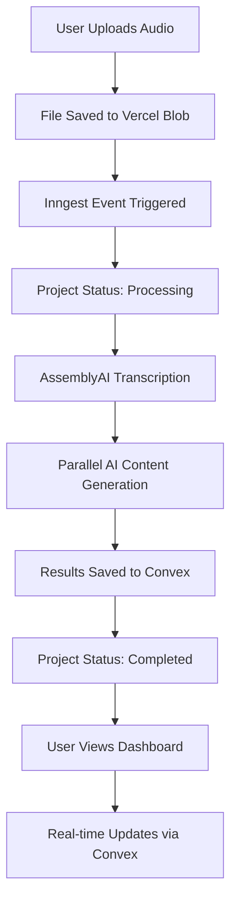
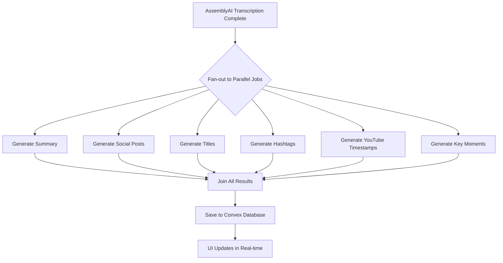
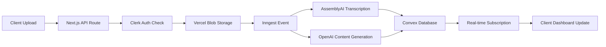

# AI Podcast SaaS

[](https://creativecommons.org/licenses/by-nc/4.0/)


## Stop Spending Hours on Content Distribution - Let AI Do It

Upload your podcast once. Get platform-optimized content for 6 social networks automatically.

---

### 📌 Who This Is For

**Podcast creators drowning in post-production work**

You've spent hours recording, editing, and producing your podcast. Now you need to:
- Write social media posts for 6 different platforms
- Create catchy titles and descriptions
- Generate timestamps for YouTube
- Find the best moments for clips
- Write captions and hashtags

**This app does all of that in 90 seconds.**

### 🎯 Key Differentiator

**End-to-end AI workflow from upload to multi-platform content**

Not just transcription. Not just summaries. A complete content distribution system powered by AI that understands your podcast and creates tailored content for every platform.

### ⚡ Technical Highlight

**Parallel AI processing with Inngest (5x faster than sequential)**

Instead of waiting 5 minutes for AI tasks to run one-by-one, we run 6 AI generation jobs simultaneously. Your content is ready in ~90 seconds total.

---

## 👇 DO THIS Before You Get Started

Set up your accounts with these services (most have free tiers):

1. **[Clerk](https://go.clerk.com/sonny)** - Authentication & Billing (Free tier available)
2. **[Inngest](https://innge.st/sonny-2)** - Workflow Orchestration (Free for developers)
3. **[CodeRabbit](https://coderabbit.link/sonny-nov)** - AI Code Reviews (Optional, for development)


---

## 🤔 What Is This App?

Think of it as **your AI newsroom for podcast content**.

Here's the simple explanation:

1. **You upload** one audio file (your podcast episode)
2. **AI analyzes** your content, understanding speakers, topics, and key moments
3. **You get** a complete content distribution package:
   - Summary with key insights
   - Social media posts tailored for Twitter, LinkedIn, Instagram, TikTok, YouTube, and Facebook
   - Title suggestions (short, long, SEO-optimized)
   - Platform-specific hashtags
   - YouTube chapter timestamps
   - Key moments for viral clips
   - Full transcript with speaker identification

**The workflow:** Record → Upload → AI Analyzes → Get Distribution Content

No manual writing. No copying and pasting between platforms. No guessing what hashtags work.

---

## 🚀 Before We Dive In - Join the PAPAFAM!

**Want to build apps like this from scratch?**

If you're looking at this project thinking "I want to learn how to build this," I've got you covered.

### 💡 What You'll Master

- **Next.js 15** - Server actions, app router, API routes, and streaming
- **Real-time Databases** - Convex for instant UI updates without polling
- **AI Integrations** - OpenAI, AssemblyAI, and prompt engineering
- **Background Jobs** - Inngest for durable, observable workflows
- **Modern Auth & Billing** - Clerk with subscription management
- **Production Deployment** - Vercel, environment variables, and monitoring

### 🎓 PAPAFAM Community Benefits

- **Private Discord** - Direct access to me and other builders
- **Code Reviews** - Get feedback on your projects
- **Weekly Q&A Sessions** - Ask anything about development
- **Job Board** - Exclusive opportunities shared with the community

### 🎯 Real Results

Students have gone from beginner to shipping production apps in weeks. Learn the same modern stack used by top startups.

### 📦 What's Included

- **50+ hours of video tutorials** - Step-by-step project builds
- **Starter templates** - Clone and customize for your projects
- **Lifetime updates** - New courses and content added regularly
- **Certificate of completion** - Show employers your skills

### 👉 [Join the PAPAFAM Course](https://www.papareact.com/course)

---

## ✨ Features

### For Podcast Creators

- **📝 AI Summary** - Comprehensive overview with bullets, key insights, and TLDR
- **📱 Social Posts** - Platform-optimized copy for 6 networks:
  - **Twitter** - 280 chars, punchy and engaging
  - **LinkedIn** - Professional tone, thought leadership
  - **Instagram** - Visual hooks with engagement questions
  - **TikTok** - Casual, trend-aware, Gen-Z friendly
  - **YouTube** - Description with CTAs and timestamps
  - **Facebook** - Community-focused conversation starters
- **🎯 Title Suggestions** - 4 different styles for every use case:
  - YouTube Short (catchy, under 60 chars)
  - YouTube Long (descriptive, SEO-friendly)
  - Podcast Titles (episode-focused)
  - SEO Keywords (discoverability)
- **#️⃣ Hashtags** - Platform-specific tags optimized for reach
- **⏱️ YouTube Timestamps** - Auto-generated chapter markers for better navigation
- **🎤 Key Moments** - AI identifies viral clip opportunities with timestamps
- **👥 Speaker Diarization** - "Who said what" with speaker labels and confidence scores

### Technical Features (The Smart Stuff)

- **⚡ Parallel AI Processing** - 6 AI jobs run simultaneously (60s total vs 300s sequential)
- **🔄 Real-time Updates** - See progress live with Convex subscriptions (no polling)
- **🛡️ Durable Workflows** - Inngest automatically retries failed steps (no lost work)
- **📊 Plan-based Feature Gating** - Features unlock based on subscription tier (Free/Pro/Ultra)
- **🎨 Dark Mode Support** - Beautiful UI that adapts to your preference
- **📦 Type-safe Throughout** - End-to-end TypeScript with Zod validation
- **🔐 Secure by Default** - Clerk authentication with row-level security

---

## 💰 Pricing Tiers

| Feature | FREE | PRO ($29/mo) | ULTRA ($69/mo) |
|---------|:----:|:------------:|:--------------:|
| **Projects** | 3 lifetime | 30/month | Unlimited |
| **File Size** | 10 MB | 200 MB | 3 GB |
| **Max Duration** | 10 min | 2 hours | Unlimited |
| **AI Summary** | ✓ | ✓ | ✓ |
| **Social Posts** | ✗ | ✓ | ✓ |
| **Titles & Hashtags** | ✗ | ✓ | ✓ |
| **YouTube Timestamps** | ✗ | ✗ | ✓ |
| **Key Moments** | ✗ | ✗ | ✓ |
| **Full Transcript** | ✗ | ✗ | ✓ |
| **Speaker Diarization** | ✗ | ✗ | ✓ |

---

## 🔧 How It Works

### User Flow



**Performance Notes:**
- Transcription: ~30-60 seconds
- AI Content Generation (parallel): ~60 seconds
- **Total Processing Time: ~90-120 seconds**

---

### Parallel AI Processing Architecture



**Why This Matters:**
- **Sequential**: 6 jobs × 50s each = ~300 seconds (5 minutes)
- **Parallel**: All jobs run simultaneously = ~60 seconds
- **Result**: 5x faster processing

---

### Data Architecture



---

## 🚀 Getting Started

### Prerequisites

Before you begin, make sure you have:

- **Node.js 18+** and **pnpm** installed
- Accounts created for all services (see "DO THIS Before You Get Started" section above)
- **Git** for version control
- A code editor (VS Code recommended)

### Installation Steps

1. **Clone the repository**

```bash
git clone <your-repo-url>
cd ai-podcast-saas-inngest-coderabbit-clerk
```

2. **Install dependencies**

```bash
pnpm install
```

3. **Set up environment variables**

```bash
cp .env.example .env.local
```

Then fill in all the required keys in `.env.local` (see Environment Variables section below).

4. **Start Convex development database**

```bash
pnpm convex dev
```

This will:
- Create a new Convex project (or connect to existing)
- Set up your database schema
- Generate TypeScript types
- Start watching for changes

5. **Start the development server** (in a new terminal)

```bash
pnpm dev
```

6. **Open your browser**

Navigate to `http://localhost:3000`

---

### Environment Variables

Create a `.env.local` file in the root directory with the following variables:

```bash
# Convex
CONVEX_DEPLOYMENT=dev:ai-podcast-saas-inngest-coderabbit-clerk
NEXT_PUBLIC_CONVEX_URL=https://your-project.convex.cloud

# Clerk
NEXT_PUBLIC_CLERK_PUBLISHABLE_KEY=pk_test_...
CLERK_SECRET_KEY=sk_test_...
CLERK_JWT_ISSUER_DOMAIN=your-domain.clerk.accounts.dev

# Vercel Blob
BLOB_READ_WRITE_TOKEN=vercel_blob_...

# Assembly AI
ASSEMBLYAI_API_KEY=...

# OpenAI
OPENAI_API_KEY=sk-proj-...
```

**Security Notes:**

- ⚠️ **NEVER commit `.env.local`** to version control
- ✅ Use `.env.example` as a template (safe to commit)
- 🔑 Variables prefixed with `NEXT_PUBLIC_` are exposed to the browser
- 🔒 Other variables are server-side only

---

### Service Configuration

#### 1. Clerk Setup (Authentication & Billing)

1. Go to [Clerk Dashboard](https://go.clerk.com/sonny)
2. Create a new application
3. Copy your publishable and secret keys to `.env.local`
4. **Enable Billing**:
   - Go to "Billing" → "Subscriptions"
   - Create three plans: `free`, `pro`, `ultra`
   - Set prices: Free ($0), Pro ($29/mo), Ultra ($69/mo)
5. **Configure Features** (match these identifiers):
   - `summary` (Free, Pro, Ultra)
   - `social_posts` (Pro, Ultra)
   - `titles` (Pro, Ultra)
   - `hashtags` (Pro, Ultra)
   - `youtube_timestamps` (Ultra only)
   - `key_moments` (Ultra only)
   - `speaker_diarization` (Ultra only)

#### 2. Convex Setup (Real-time Database)

1. Go to [Convex Dashboard](https://convex.dev)
2. Create a new project
3. Copy your deployment URL to `.env.local`
4. The schema will auto-deploy when you run `pnpm convex dev`

#### 3. Vercel Blob Setup (File Storage)

1. Go to [Vercel Dashboard](https://vercel.com)
2. Create a new project (or use existing)
3. Go to "Storage" → "Create Database" → "Blob"
4. Copy the `BLOB_READ_WRITE_TOKEN` to `.env.local`

#### 4. Inngest Setup (Workflow Orchestration)

1. Go to [Inngest Dashboard](https://innge.st/sonny-2)
2. Create a new app
3. Copy your Event Key and Signing Key to `.env.local`
4. In development, Inngest will auto-discover your functions

#### 5. AssemblyAI Setup (Transcription)

1. Go to [AssemblyAI Dashboard](https://www.assemblyai.com/dashboard)
2. Create an account (free tier available)
3. Copy your API key to `.env.local`
4. **Pricing**: ~$0.00025/second (~$0.65 per hour of audio)

#### 6. OpenAI Setup (AI Content Generation)

1. Go to [OpenAI Platform](https://platform.openai.com)
2. Create an API key
3. Add credits to your account (pay-as-you-go)
4. Copy your API key to `.env.local`
5. **Model Used**: GPT-4 (~$0.10 per podcast episode)

---

### First Time Setup Checklist

Before uploading your first podcast, verify:

- [ ] All environment variables are set in `.env.local`
- [ ] Convex database is running (`pnpm convex dev`)
- [ ] Clerk application is configured with billing plans
- [ ] Inngest is connected (check logs when you start dev server)
- [ ] You can access the app at `http://localhost:3000`
- [ ] Test upload with a small audio file (under 10MB)

---

## 📊 Database Schema Overview

### Main Model: `projects` Table

The entire application revolves around a single `projects` table in Convex. This denormalized structure allows for atomic updates and real-time reactivity.

**Key Fields:**

| Field | Type | Description |
|-------|------|-------------|
| `userId` | string | Clerk user ID (links project to user) |
| `inputUrl` | string | Vercel Blob URL for uploaded file |
| `status` | enum | `uploaded` → `processing` → `completed` or `failed` |
| `jobStatus` | object | Granular status for `transcription` and `contentGeneration` |
| `transcript` | object | Full transcript with segments, speakers, chapters |
| `summary` | object | AI-generated summary with bullets, insights, TLDR |
| `socialPosts` | object | Platform-specific posts (Twitter, LinkedIn, etc.) |
| `titles` | object | Title suggestions (YouTube, podcast, SEO) |
| `hashtags` | object | Platform-specific hashtag recommendations |
| `youtubeTimestamps` | array | Chapter markers for YouTube descriptions |
| `keyMoments` | array | Viral clip opportunities with timestamps |

**Design Decisions:**

- **Denormalized structure** - All data in one document for atomic updates
- **Optional fields** - Allow progressive population as Inngest jobs complete
- **Indexes** - Optimize queries by user, status, and creation date
- **Real-time reactivity** - Convex subscriptions trigger UI updates automatically

**Indexes:**

- `by_user` - List all projects for a user
- `by_status` - Filter by processing status
- `by_user_and_status` - User's active/completed projects
- `by_created_at` - Sort by newest first

---

## 🚀 Deployment

### Vercel Deployment (Recommended)

1. **Push your code to GitHub**

```bash
git add .
git commit -m "Initial commit"
git push origin main
```

2. **Import to Vercel**

- Go to [Vercel Dashboard](https://vercel.com)
- Click "Import Project"
- Select your GitHub repository
- Vercel will auto-detect Next.js

3. **Add environment variables**

In Vercel dashboard → Settings → Environment Variables, add all variables from your `.env.local`

4. **Deploy**

Vercel will automatically deploy on every push to `main`

5. **Configure custom domain** (optional)

Settings → Domains → Add your domain

---

### CLI Deployment

```bash
npx vercel --prod
```

Follow the prompts to deploy.

---

### Post-Deployment Checklist

After deploying to production:

- [ ] All environment variables set in Vercel dashboard
- [ ] Inngest production environment configured (separate from dev)
- [ ] Clerk production instance connected
- [ ] Update `NEXT_PUBLIC_APP_URL` to your production URL
- [ ] Test upload on production with a small file
- [ ] Monitor Inngest dashboard for workflow errors
- [ ] Check Vercel logs for any runtime errors

---

### Monitoring & Observability

Keep an eye on these dashboards:

- **Inngest Dashboard** - Workflow execution logs, retry attempts, failures
- **Convex Dashboard** - Database queries, performance metrics, real-time connections
- **Vercel Analytics** - Traffic, page views, edge function performance
- **Clerk Dashboard** - User signups, active subscriptions, billing events

---

## 🐛 Common Issues & Solutions

### Development Issues

#### Error: Convex not connected

**Problem:** Can't connect to Convex database

**Solution:**
```bash
# Make sure Convex dev server is running in a separate terminal
pnpm convex dev
```

#### Error: File upload fails

**Problem:** Upload returns 400 or 500 error

**Solution:**
- Check Vercel Blob is enabled in your project settings
- Verify `BLOB_READ_WRITE_TOKEN` is set correctly
- Check browser console for CORS errors

#### Error: Inngest not triggering

**Problem:** File uploads but processing never starts

**Solution:**
- Verify `INNGEST_EVENT_KEY` and `INNGEST_SIGNING_KEY` in `.env.local`
- Check Inngest dev server is connected (look for logs in terminal)
- Ensure `/api/inngest` route is accessible

---

### Database Issues

#### Projects not appearing

**Problem:** User uploads file but can't see it in dashboard

**Solution:**
- Check Clerk `userId` matches project `userId` in database
- Verify Convex provider wraps your app in `app/layout.tsx`
- Check browser console for Convex connection errors

#### Real-time updates not working

**Problem:** Dashboard doesn't update automatically during processing

**Solution:**
- Ensure `ConvexProvider` wraps your app
- Verify you're using `useQuery` (not `fetchQuery`) for reactive data
- Check Convex dashboard for connection issues

---

### Authentication Issues

#### Clerk redirect loops

**Problem:** Stuck in infinite redirect after sign in

**Solution:**
- Verify `NEXT_PUBLIC_CLERK_PUBLISHABLE_KEY` is set correctly
- Check Clerk dashboard for correct redirect URLs
- Clear browser cookies and try again

#### Billing not working

**Problem:** Users can't upgrade or plan limits not enforced

**Solution:**
- Configure plans in Clerk dashboard with correct identifiers: `free`, `pro`, `ultra`
- Ensure feature identifiers match `tier-config.ts`
- Check Clerk webhook configuration for subscription events

---

### Processing Issues

#### AI generation stuck

**Problem:** Project stuck in "processing" status

**Solution:**
- Check Inngest dashboard for error logs
- Verify `OPENAI_API_KEY` is valid and has credits
- Check OpenAI API status page for outages

#### Transcription fails

**Problem:** Transcription step fails immediately

**Solution:**
- Verify `ASSEMBLYAI_API_KEY` is valid
- Check file format is supported (MP3, MP4, WAV, etc.)
- Ensure file URL is publicly accessible
- Check AssemblyAI dashboard for quota limits

#### Plan features not gating

**Problem:** Free users see Pro/Ultra features

**Solution:**
- Verify Clerk plan configuration matches `tier-config.ts`
- Check plan detection logic in `lib/tier-utils.ts`
- Ensure `has` function is called correctly in API routes

---

## 🏆 Take It Further - Challenge Time!

Want to level up this project? Here are some advanced features you can build:

### Advanced Features to Build

- **📄 Export to PDF/Google Doc** - Generate beautiful PDF reports with all content
- **📅 Social Media Scheduling** - Integration with Buffer or Hootsuite for auto-posting
- **🌍 Multi-language Support** - Transcribe and translate to 10+ languages
- **🎨 Custom AI Tone Presets** - Let users define brand voice for AI generation
- **📦 Batch Processing** - Upload 10 episodes, process all overnight
- **🎥 Video Clip Generation** - Automatically create video clips from key moments
- **📊 Analytics Dashboard** - Track which content performs best across platforms

### AI Improvements

- **🧠 Fine-tuning** - Train GPT on user's specific podcast style
- **💬 Custom Prompts** - Let users write their own prompt templates per platform
- **😊 Sentiment Analysis** - Automatically tag moments as funny, insightful, controversial
- **A/B Testing** - Generate multiple title variations and track which performs best
- **🔍 Content Recommendations** - "Based on this episode, you should talk about..."

### Infrastructure & Scaling

- **☁️ Cloudflare R2** - Migrate from Vercel Blob for cheaper long-term storage
- **⚡ Redis Caching** - Cache frequently accessed projects and transcripts
- **🪝 Webhook Notifications** - Alert users via email/SMS when processing completes
- **🔧 Separate Worker Service** - Move heavy processing to dedicated infrastructure
- **📊 Usage Analytics** - Track costs per user for better pricing optimization

### Monetization Features

- **👥 Team Plans** - Multi-user access with role-based permissions
- **🏷️ White-label Option** - Let agencies rebrand the app for their clients
- **🔌 API Access** - Enterprise tier with REST API for automation
- **💳 Credits System** - Pay-per-use model instead of subscriptions
- **🎁 Referral Program** - Reward users for bringing in new customers

**Pick one feature and build it!** Then submit a PR or share in the PAPAFAM Discord. I'd love to see what you create.

---

## 📄 License

This project is licensed under the **Creative Commons Attribution-NonCommercial 4.0 International License (CC BY-NC 4.0)**.

### You CAN:

- ✅ Use this code for **personal learning** and education
- ✅ Modify and adapt the code for your own projects
- ✅ Share the code with others (with attribution)
- ✅ Use it in your **portfolio** (non-commercial showcase)
- ✅ Fork, clone, and experiment with the codebase

### You CANNOT:

- ❌ Use this code for **commercial purposes** (selling, SaaS, client work)
- ❌ Sell this application or derivatives of it
- ❌ Remove attribution to the original author
- ❌ Relicense the code under different terms

### For Commercial Licensing

Interested in using this project commercially? I offer flexible licensing options:

- **Startup License** - For early-stage companies (<$100k revenue)
- **Enterprise License** - For established businesses
- **White-label License** - Full customization rights for agencies

**Contact me:** Open an issue on GitHub or reach out through the PAPAFAM team email at team@papareact.com

Full license text: [LICENSE.md](./LICENSE.md)

---

## 📚 Quick Reference

### Useful Commands

```bash
# Development
pnpm dev          # Start Next.js dev server + Convex watch
pnpm build        # Build for production
pnpm start        # Start production server
pnpm lint         # Run Biome linter
pnpm format       # Format code with Biome

# Convex
pnpm convex dev   # Start Convex development database
pnpm convex deploy # Deploy Convex to production

# Deployment
npx vercel        # Deploy to Vercel (preview)
npx vercel --prod # Deploy to production
```

---


### Important Concepts

**Plan-based Feature Gating**

Features are enabled based on the user's Clerk subscription tier:
- **Free**: Summary only (3 projects lifetime)
- **Pro**: + Social posts, titles, hashtags (30 projects/month)
- **Ultra**: + YouTube timestamps, key moments, full transcript (unlimited)

**Parallel AI Processing**

Instead of running AI generation tasks sequentially (slow), Inngest runs 6 jobs in parallel using `Promise.allSettled`. This reduces processing time from ~5 minutes to ~60 seconds.

**Real-time Updates**

Convex subscriptions (`useQuery`) automatically re-render components when database data changes. No polling, no manual refetching. As Inngest updates the project status, the UI updates instantly.

**Durable Execution**

Inngest provides automatic retry logic. If OpenAI times out or AssemblyAI fails, the step retries with exponential backoff. Your users never lose work.


## 🙏 Acknowledgments

Built with incredible tools from:
- [Clerk](https://go.clerk.com/sonny) - Authentication & Billing
- [Inngest](https://innge.st/sonny-2) - Workflow Orchestration
- [Convex](https://convex.dev) - Real-time Database
- [Vercel](https://vercel.com) - Deployment & Storage
- [AssemblyAI](https://www.assemblyai.com) - Audio Intelligence
- [OpenAI](https://platform.openai.com) - AI Content Generation

---

## 💬 Questions or Issues?

- **Found a bug?** Open an issue on GitHub
- **Need help?** Join the [PAPAFAM Discord](https://www.papareact.com/course)
- **Want to contribute?** PRs welcome (see LICENSE for terms)

---

**Built with ❤️ for the PAPAFAM community**
